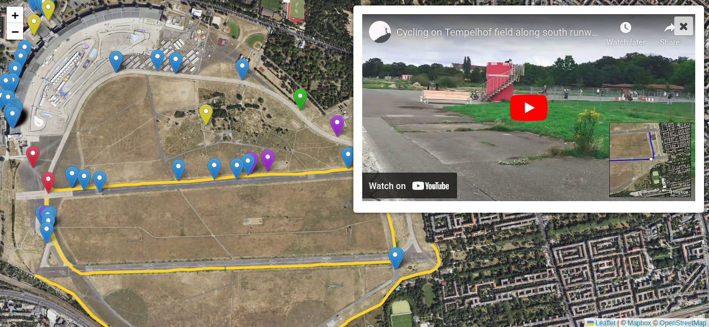

# ExifMapper
ExifMapper georeferences photographs with location in exif data on a Leaflet map.

It also allows:
- manual georeferencing of resources (and location correction)
- multiple resource type embedded visualizations
    - photographs
    - 360 photospheres
    - video
    - audio
    - YouTube videos
    - URL links
- adding comments to resources
- exporting of a static webmap
- parallel editing of resources (using WebSockets)

## Designed use case
You are going on a field trip or excursion of some sort and you have told your students/participants to all enable location saving in their device (e.g., smart-phone, tablet) photo app.

Have students take pictures, create PhotoSpheres, take videos, record sound.

Gather everyone's resources together and place them in the `data/unsorted` folder. Follow the directions below.
ExifMapper will provide a webmap with all resources spatially visible by type. You can manually add links to other resources, such as YouTube videos, or other sites.

## Instructions
1. Place all your photographs in a folder path: **photos/sorted/**
2. Run the **process_images.py** script
    - The script uses the ExifRead package, you can install it in a variety of ways:
        - With pip `pip install ExifRead`
        - With ppt (Debian/Ubuntu) `sudo apt install python3-exifread`
    - The script will determine which images have location included and move them to the the data/georef folder
    - Resources without lat/lng exif data will be moved to data/noloc
    - The process populates a data file (data/data.csv) that is used by the webmap
3. Load the PHP dependencies:
    - Using Composer run: `composer update`
4. Provide permissions for your server to modify the contents of the `data` folder/directory.
    - In terminal `chmod -R XXX data` where XXX is appropriate.
3. Open the index.html file in a browser. All the photos with location should be visible.
    - You can extensively customize the map's contents until you are content.
4. Export the finalized 'static' web-map.
    - The resulting export is contained in `data/export/` and can be copied to any location as it contains all dependencies.

### Additional configuration options 
- If you provide ExifMapper online anyone with the link can delete resources, edit comments, or add links. I strongly recommend placing restrictions on accessing the resource (e.g. .htaccess file)
- To allow parallel user-processing with WebSockets:
    - Have the PHP script `activate_synchronisation.php` run in the background.
    - You may need to update the js/exmap.js URL for the websocket url onload (search WebSocket) and set the 'wss:' protocol as needed.
- If you wish to use Mapbox, or some other tileset, for map tiles rather than the OSM default, configure the options in js/exmap.js

## ExifMapper Actions

### Main resource customization
Clicking on any existing marker allows the following straight-forward actions:
- Deleting the resource (actually just moves it to the `data/garbage` folder)
- Move the marker location
    - When clicking on this button ExifMapper will check if you have placed any GeoJSON spatial resources in the `data/geo_data` directory, and list them. Clicking on the spatial file will associate the resource with that feature.
- Add a comment to the resource. This provides a caption. Click save after entering the text.
- While ExifMapper tries to determine the type of the resource, you can explicitly state what it is (e.g., image, 360 degree photosphere, audio recording, video). This changes the marker type.

### Manual georeferencing
You can also manually georeference resources from the list in the bottom left of the page. These resources can be associated with markers or GeoJSON features. You must georeference these resources before you can add a comment or define a type.

### Adding external markers
You can add marker to online resources, such as YouTube, or any other website by using the 'New URL Marker' in the bottom right of the page.
After clicking the 'New URL Marker' button, simply click the location on the map.

### Exporting
Finally, once you are content with the webmap, you can export it. Click the yellow 'Export' button in the bottom right of the page. This may take a few minutes as all the required resources are copied to `data/export/`.
Confirm that the page is working as expected and you can then move this folder to another location/platform for public viewing.
The exported resource is static and does not require PHP or Python.
It is recommended that you backup or keep the interactive version of ExifMapper until you are sure no further changes are required.

### Static edits
In the exported resource it is still possible to make changes by modifying the `data/export/meta_data.csv`. The content structure is fairly straight-forward in regards to where the resources of different types are and what marker type should be used.

